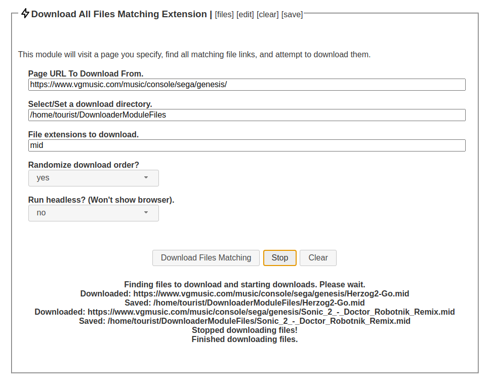

# WebANYTHINGStudio: File Downloader Module

This module will find all links matching a file type, and download them all.  Download order can be randomized if desired.  Since this is a sample module, files are downloaded one by one for code clarity.  If you want to download more than that you can use various async utilities to do so (async.eachLimit or Promise.all).

* module_main.js: Main process code.

* module_ui.js: UI process code.

