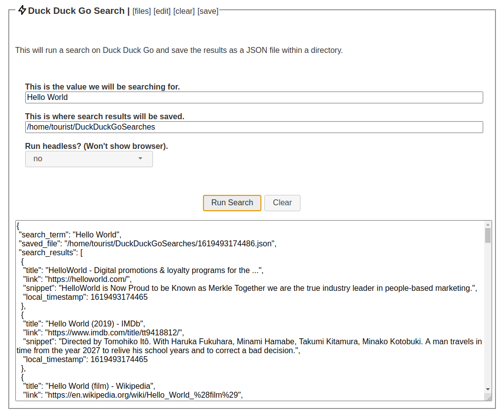

# Duck Duck Go Search and Store Results

This module will let you seach duck duck go, and store search results.  

Concepts: Using keyboard and mouse events to click and type, waiting for conditional selectors and clicking buttons, storing results.

* module_main.js: Main process code.

* module_ui.js: UI process code.

