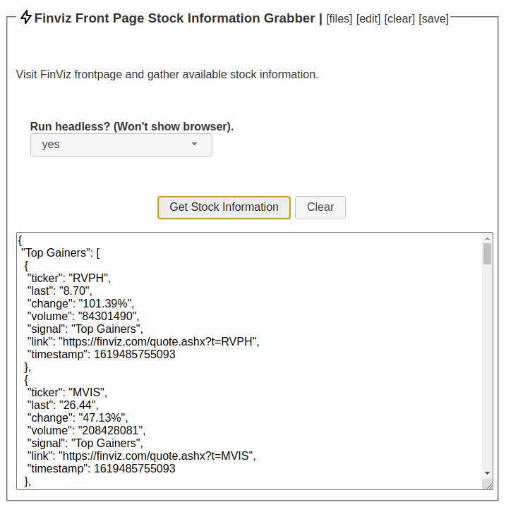

# FinViz Front Page Stock Information

This module simply demonstrates how to visit a page, parse out some tables, and
gather that data within a JSON object.  We have arbitrarily chosen finviz to 
demonstrate this concept, as it's neat to have financial data.

However, the same concepts can be extended to extract table data from most sites
so you can use this module as a template for similar projects.

Concepts: Parsing tables from DOM, randomizing window size, data sorting and JSON.

* module_main.js: Main process code.

* module_ui.js: UI process code.

