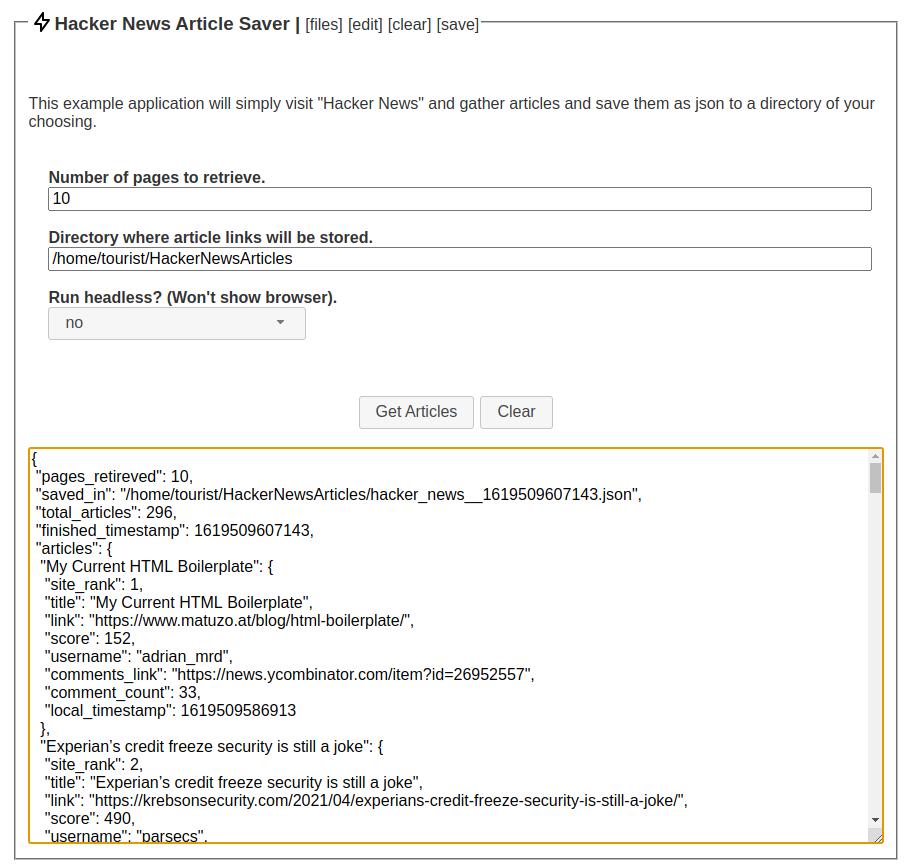

# Hacker News: Article Saver

[Get WebANYTHINGStudio here.](https://www.webanythingstudio.com)

This module will save articles from hacker news.  Yes, we are aware that you can simply use rss
feeds to get articles, but this module is an example use case, and is designed to introduce
module development concepts which can be used on other module projects.

- Visits [https://news.ycombinator.com/](https://news.ycombinator.com/).
- Gathers articles and metadata.
- Moves to next page, merging articles into a full set.
- When at the end of desired page count, exit and save results to a json file on the disk.

Concepts: Parsing page content, moving between pages, saving data.

* module_main.js: Main process code.

* module_ui.js: UI process code.

